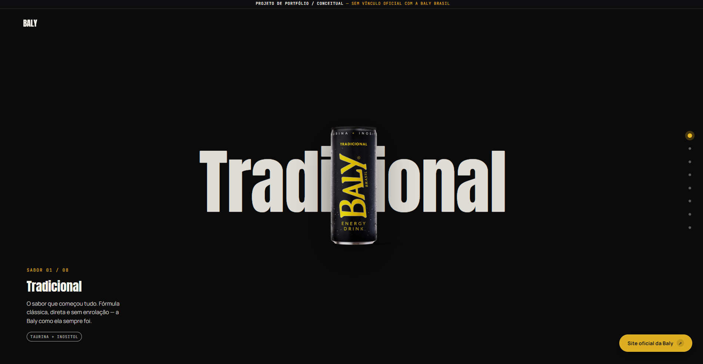
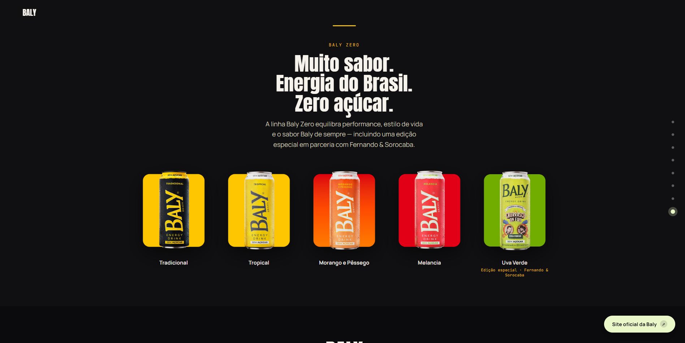

# Baly Sabores

**Landing page conceitual para uma experiência de produto mais imersiva.**

---

## Sobre

**Baly Sabores** é um projeto conceitual e não oficial desenvolvido para explorar uma abordagem mais visual e interativa para apresentação de produtos.

A ideia foi transformar a navegação em uma experiência contínua, onde cada sabor possui seu próprio momento visual e a transição entre eles acontece através do scroll.

---

## A experiência

A landing page foi estruturada como uma sequência de momentos:

`INTRO` → `TRADICIONAL` → `SABORES` → `A BALY` → `BALY ZERO` → `CTA`

Cada etapa altera a composição da tela, criando novas combinações de produto, tipografia, cor e movimento.

O objetivo não foi criar apenas uma página para mostrar produtos, mas uma experiência que **mantém o usuário explorando a página**.

---

## Direção visual

A interface trabalha com:

**Produtos em destaque**
As embalagens são o principal elemento visual da composição.

**Cores por sabor**
Cada produto possui uma atmosfera própria para criar diferenciação ao longo da navegação.

**Movimento**
Transições e animações acompanham o scroll para criar continuidade entre as seções.

**Composição**
Elementos são posicionados para criar profundidade e direcionar a atenção para o produto.

---

## O resultado

Uma landing page com uma abordagem mais próxima de uma **experiência de campanha digital** do que de uma página tradicional de produtos.

O projeto foi desenvolvido para explorar principalmente:

**Direção de arte · Product presentation · Motion · Scrollytelling · Interactive design · Responsive design**

---

## Projeto conceitual

Este projeto **não possui vínculo oficial com a Baly Brasil** e foi desenvolvido exclusivamente para fins de estudo, experimentação e portfólio.

---

**Paloma Garcia Lorenzon**
Design & Front-end
